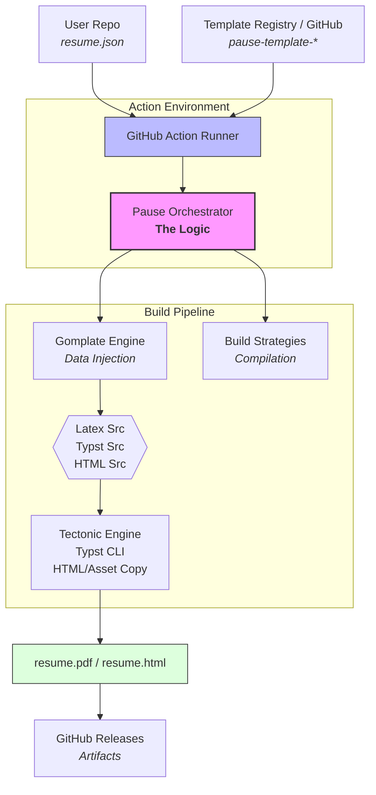

# Project Pause: System Specification

> **Status**: 📜 Historic Document  
> **Created**: 2026-01-27  
> **Purpose**: Original design specification - preserved for reference  
> **Current Docs**: See [STATUS.md](STATUS.md) for implementation status

**Version:** 0.1.0 (Draft)  
**Concept:** "Pause > Resume"

**Goal:** A "Push-to-Publish" orchestration system that transforms a `resume.json` data file into multiple compiled formats (PDF, HTML) using a universal templating engine and containerized build steps.

## 1. High-Level Architecture

The system operates strictly within a GitHub Actions environment. It follows a "Config-Once, Write-Forever" philosophy. The user manages data; the system manages the build pipeline.

### 1.1 The Data Flow



## 2. Core Components

### 2.1 The Data Source

- **Format:** [JSON Resume](https://jsonresume.org/schema/) standard.
- **Default Filename:** `resume.json` (configurable).
- **Location:** Root of the user's repository.

### 2.2 The Pause Action (The Orchestrator)

This is the central logic, implemented as a Composite GitHub Action.

- **Role:**

1. Parse the `templates` input list.
2. Install necessary CLI tools (Gomplate, Tectonic, Typst).
3. Iterate through requested templates.
4. Execute the **Gomplate Strategy** (Render).
5. Execute the **Build Strategy** (Compile).
6. Upload results to GitHub Releases.

### 2.3 The Template Standard (The Contract)

A repository is considered a valid "Pause Template" if:

1. The repository name starts with `pause-template-` (Convention).
2. It contains a manifest file at the root named `template.yaml` (or `.toml`, `.json`, `.kdl`, `.json5`).

## 3. The "Pause Template" Specification

Every template must describe how it should be filled and how it should be built.

### 3.1 Directory Structure

```text
pause-template-modern/
├── template.yaml       # The Manifest
├── main.tex.tmpl       # The Entrypoint (Gomplate syntax)
├── assets/             # Images, fonts, or cls files
│   ├── logo.png
│   └── styles.cls
└── README.md

```

### 3.2 Manifest Schema (`template.yaml`)

| Field         | Type   | Required | Description                                                                   |
| ------------- | ------ | -------- | ----------------------------------------------------------------------------- |
| `name`        | String | Yes      | Human-readable name (e.g., "Modern Serif").                                   |
| `type`        | Enum   | Yes      | One of: `latex`, `typst`, `html`, `markdown`.                                 |
| `entrypoint`  | String | Yes      | The primary template file to process (e.g., `main.tex.tmpl`).                 |
| `output_name` | String | Yes      | Desired output filename _before_ extension (e.g., `resume`).                  |
| `build_cmd`   | String | No       | Override command. If omitted, Pause uses the default strategy for the `type`. |
| `delimiters`  | Array  | No       | Custom delimiters. Default: `["[[", "]]"]`.                                   |

**Example `template.yaml` (LaTeX):**

```yaml
name: "Academic CV"
type: "latex"
entrypoint: "cv.tex.tmpl"
output_name: "academic-resume"
# No build_cmd needed; Pause detects 'latex' and implies Tectonic
```

**Example `template.yaml` (HTML):**

```yaml
name: "Web Portfolio"
type: "html"
entrypoint: "index.html.tmpl"
output_name: "index"
```

## 4. The Processing Logic

### 4.1 Templating Engine: Gomplate

We use Gomplate to inject JSON data into the source files _before_ compilation.

- **Delimiters:** We enforce `[[` and `]]` as default global delimiters to avoid conflicts with LaTeX `{}` and CSS `{}`.
- **Input Context:** The `resume.json` content is available at the root dot context (`[[ .basics.name ]]`).
- **Sanitization:** Pause will inject custom Gomplate functions map:
- `latex`: Escapes special LaTeX characters (`&`, `%`, `$`, `#`, `_`, `{`, `}`).
- `html`: Standard HTML entity escaping.
- `typst`: Escapes Typst syntax.

**Example Template (`cv.tex.tmpl`):**

```latex
\documentclass{article}
\begin{document}
  \name{ [[ .basics.name | latex ]] }
  \section{Experience}
  [[ range .work ]]
    \job{ [[ .name | latex ]] }{ [[ .position | latex ]] }
  [[ end ]]
\end{document}

```

### 4.2 Build Strategies

The Orchestrator selects the build tool based on the `type` field in the template manifest.

#### Strategy A: LaTeX (via Tectonic)

- **Trigger:** `type: "latex"`
- **Tool:** [Tectonic](https://tectonic-typesetting.github.io/) (Rust-based).
- **Process:**

1. Gomplate renders `*.tmpl` files to their native extensions.
2. Action runs: `tectonic rendered_file.tex`.
3. Tectonic automatically fetches packages/fonts during run.
4. Resulting `.pdf` is staged for release.

#### Strategy B: Typst

- **Trigger:** `type: "typst"`
- **Tool:** `typst-cli` (Rust-based).
- **Process:**

1. Gomplate renders `*.tmpl` -> `*.typ`.
2. Action runs: `typst compile rendered_file.typ`.

#### Strategy C: HTML / Static

- **Trigger:** `type: "html"`
- **Tool:** None (Pure file generation) or Optional Post-Process command.
- **Process:**

1. Gomplate renders `*.tmpl` -> `*.html`.
2. Assets folder is preserved.
3. Entire directory is zipped for release OR deployed to Pages (future scope).

## 5. User Integration (The GitHub Action)

Users integrate Pause by adding a workflow file to their repo. The template list is passed directly as an input parameter.

### 5.1 Workflow File: `.github/workflows/pause.yml`

```yaml
name: Build Resume

on:
  push:
    branches: [main]
    paths:
      - "resume.json" # Only trigger when data changes
      - ".github/workflows/pause.yml"

jobs:
  publish:
    runs-on: ubuntu-latest
    permissions:
      contents: write # Needed for Releases

    steps:
      - uses: actions/checkout@v4

      - name: Pause > Resume
        uses: usually-frustrated/pause@main
        with:
          # The Input Data
          resume_file: "resume.json"

          # The Template List (The "Canvas")
          # Format: provider:user/repo or path/to/local
          templates: |
            github:usually-frustrated/pause-template-minimal
            github:usually-frustrated/pause-template-academic
            github:another-user/pause-template-fancy

          # GitHub Token for API access (cloning templates + releasing)
          github_token: ${{ secrets.GITHUB_TOKEN }}
```

## 6. Implementation Roadmap

### Phase 1: The Core Action

- [ ] Create `usually-frustrated/action` repository.
- [ ] Implement `action.yml` (inputs definition).
- [ ] Write logic (Node.js or Docker) to:
- [ ] Install Gomplate/Tectonic/Typst binaries.
- [ ] Parse the `templates` multiline string.
- [ ] `git clone` the requested templates.
- [ ] Run the render/build loop.

### Phase 2: The Template Registry

- [ ] Create `usually-frustrated/pause-template-minimal` (LaTeX/Tectonic example).
- [ ] Create `usually-frustrated/pause-template-typst` (Typst example).
- [ ] Document the `template.yaml` spec for community contributors.

### Phase 3: The Helper Functions

- [ ] Write the Gomplate plugin/function map for `| latex` and `| typst` sanitization to ensure JSON data doesn't break the build.

## 7. Technical Constraints & Decisions

1. **Binaries vs Docker:** We will prefer downloading pre-compiled binaries (Tectonic, Typst, Gomplate) in the Action setup phase rather than using a monolithic Docker container. This speeds up the action (Tectonic is ~20MB vs TexLive Docker @ 4GB).
2. **Delimiters:** We strictly enforce `[[ ]]` in documentation. While Gomplate allows configuration, changing it per template might confuse users. We standardize on `[[ ]]` for the "Pause Ecosystem".
3. **Local Dev:** We will provide a CLI wrapper eventually (`pause build`) that mimics the Action logic for local testing, but the primary focus is GitHub Actions.
